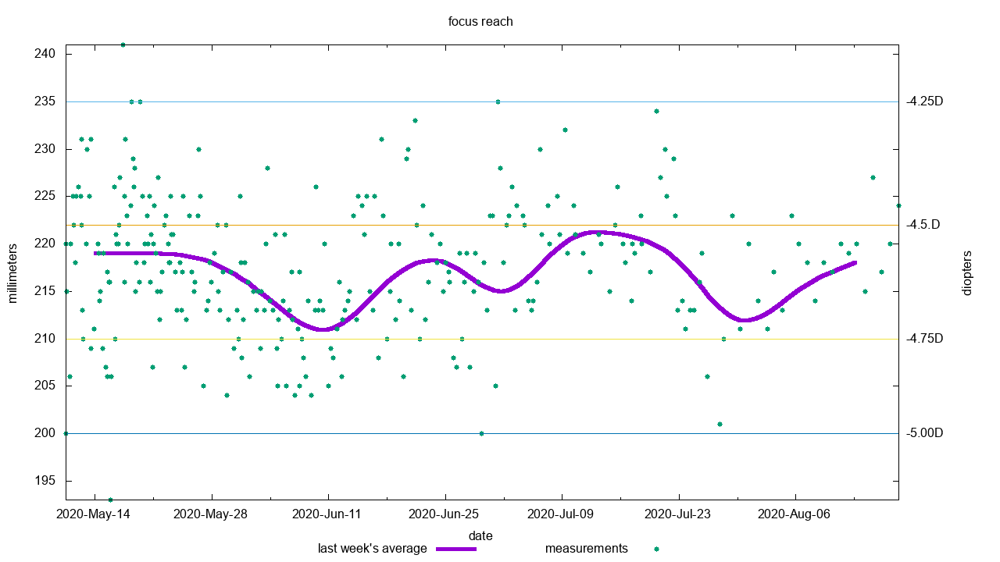

# focusreach

my myopia keeps worsening.
hence i decided to track it.
for measurements i use a standard self-retracting metal tape measure.
i taped a small piece of paper between the tape and the button.
i wrote a few letters onto the paper.
it's like a mini, 1 row snellen chart.
then i put the tape hook to my forehead
and retract the case just before the slightest blur starts.
i take note of the distance on the tape in millimeters.
this is how the measurement looks like from my eyes:


then i put that into a data file.
it's a space separated list separated list of tokens,
followed by an optional freeform comment.
the columns are the following:

```
mmdd hhmm central left right flags comment
```

mmdd hhmm is the time (the year number is in the filename).
central, left, right are distances in millimeters.
that's how far i see without glasses.
flags is a list of characters.
each character describes either the environment of the measurement,
or the activity i did before the measurement.
environmental flags:

- b as in bright: indoors but with lots of natural light.
- u as in sunglight: directly under the sun.
- l as in lit: in an artificially lit room.
- t as in tired tired: felt tired as i was doing the measurement.
- y as in dry: my eyes felt very dry just before or during the measurement.

activity tags:

- s as in sleep: right after some sleep or nap.
- n as in no glasses: used no glasses at all.
- r as in reduced: used reduced glasses.
- d as in distance: i wore my distance glasses.
- e as in exercise: i did some eye exercises.
- o as in outdoor: i was outside.
- w as in work: i did closeup work (e.g. computer, reading, writing).

not sure if i'll ever analyze those flags,
but there's no harm in collecting them.

here is my progress over time:



i generate the above graph using the plot utility from this repo.

for reference here are my autorefactor results from optometrists.
this data is not included in the above graph.
i don't really know my previous data so i omitted it rather than guessing it.

```
2019-Feb-01 sph:-4.75,-4.75 pd:33,33
2019-Mar-20 started wearing -4.25D lenses
```
