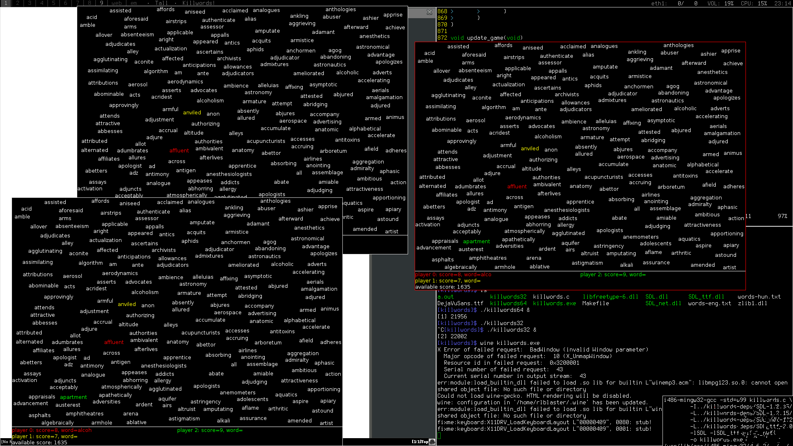

# Killwords

This is a keyboard killer game. When you start the game lots of words appear.
All you have to is to type them. Type a word, press enter and profit. You can
type free words. Free words are those which weren't typed by any player so far.
For each word you get a score based on the word's length. If you have typed a
long word and want to erase the prompt just press Escape.

The game ends when the players have typed all the words. At the end the player
with the most score wins. 

The .zip file contains the source along with prebuilt Linux and Windows
binaries.

Development timelapse: https://youtu.be/plQK9-sO5UE

