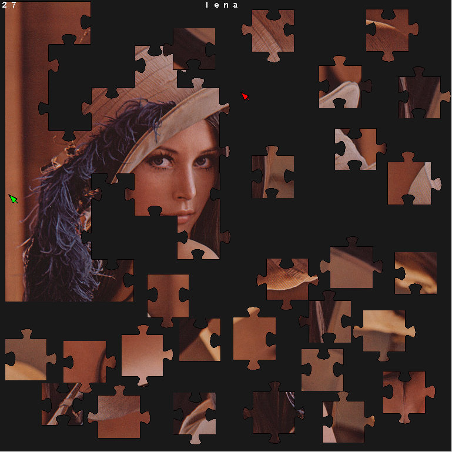

# Together - a multiplayer jiggsaw puzzle game

A friend of mine and me wanted to solve jigsaw puzzles together over the
internet. We've found a flash version of a multiplayer jigsaw puzzle solver but
it lagged awfully bad and flash doesn't work well on my linux box. There was an
another flash game but it couldn't even start. So I've created my own
multiplayer jigsaw puzzle solver: Together

All you have to do in this games is to solve the puzzle! Just drag the fitting
pieces next to each other and the program merges them. You can drag the pieces
with the left mouse button and rotate them using the right mouse button.

To play alone just type the following into the console:

```
together snowman himnusz parrot
```

This loads the snowman, himnusz and parrot puzzles into the game. You can switch
between them using 'n' and 'p' keys. Look into the pics folder to view what
puzzles are available.

To play collaboratively you need to start a server:

```
server 12345
```

This starts the server on the port 12345. The first player can join via the
following command:

```
together -s hostname 12345 snowman himnusz parrot
```

This loads snowman, himnusz and parrot puzzles into the game. Then the first
player can switch between the puzzles via 'n' and 'p' keys. Other players can
join via the following command:

```
  together -s hostname 12345
```

BEWARE: All players must have the puzzles available on their computer in order
to play them.

Loading is slow, please be patient. (I could make it faster, I'm just lazy.).

The .zip file contains the source along with prebuilt Linux and Windows
binaries.


