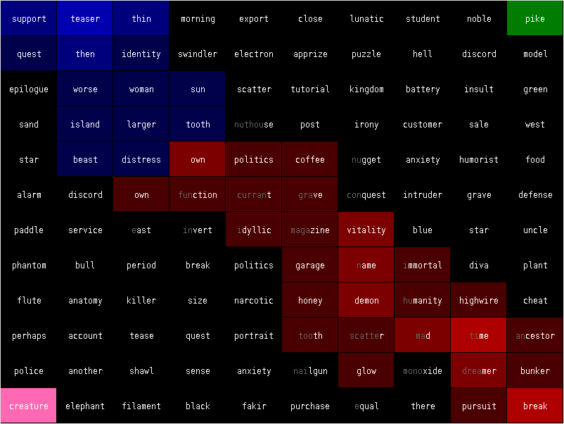

# Typewars



After playing a lot of The Typing of the Dead and TypeRacer I was interested
whether it is possible create a multiplayer typing game where the goal of the
players is to destroy each other with their typing skills instead of just racing
with each other. A typing game where strategy would matter. A typing game where
you could form alliances. Here's my try: Typewars

This is a 4 team game. The teams are: red, blue, green and pink. Each team can
have more players in it, but usually a team is controlled by one player.

The map is a grid of 12 x 10 cells. Each cell has a word on it. Each cell can
belong to a team (or if it doesn't belong to anybody, it is black). To "attack"
a cell just type the word from the cell. In order to do that you have to have a
neighboring cell belonging to your team. Each cell has 3 level. If you are
attacking a foreign cells, you are downgrading its level. When you downgrade the
cell's level to zero, you acquire the cell with level 1. If you are attacking
your own cells, you are increasing its level. For example if the blue team has
the cell on the third level and you type the word you just downgrade it to the
second level. Now if the blue team types the word in it will upgrade back to the
third level. But if the blue team had level 1 and attack the cell, you acquire
the cell. Just try the game out to get a feel of it!

In order to play this game, you have to create a server and players have to join
it. The server and the client is in the same executable. To create server on
port 12345 type the following to the command line:

```
  typewars S localhost 12345 4
```

Then the first player can join the server with the following command:

```
  typewars C hostname 12345 0
```

And the second player:

```
  typewars C hostname 12345 1
```

The third:

```
  typewars C hostname 12345 2
```

BEWARE: Do NOT press any keys until all the players have joined! The server is
way too dumb to handle late joins (you won't get errors but the game will be out
of sync).

The .zip file contains the source along with prebuilt Linux and Windows
binaries.
